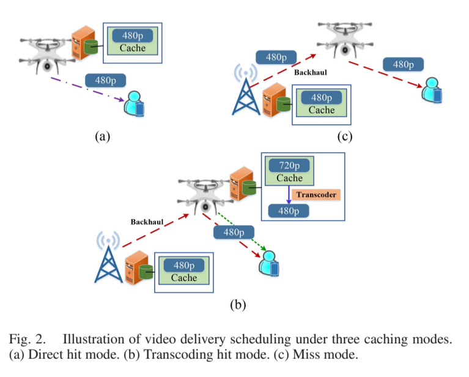
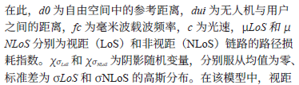

1. 系统模型（三种情况）
   1. 总模型
    
    （a）视频文件恰好缓存在无人机服务器中，无人机将直接将其传输给用户。
    （b）如果不存在直接缓存命中，但无人机缓存了相同请求文件的更高比特率版本，即可能触发转码命中模式。在这种情况下，我们假设视频被分成多个片段[32]。每个片段都可以通过无人机服务器的本地转码获得并传输给用户，或者通过无线回程链路从基站获取。换句话说，转码调度可以针对视频内容的一部分进行。通过转码获取多少内容以及通过回程检索获取多少内容取决于这两种选择的延迟和能量成本。
    （c）对于缺失模式，既没有请求的版本，也没有可转码的版本，无人机从基站缓存中获取文件并转发给终端用户。
    2. 传输模型
       1. 用户-UAV
          1. 路径损耗
          $$
           PL^{LoS}_{u_i} = 20 \log \left( \frac{4 \pi f_c d_0}{c} \right) + 10 \mu_{LoS} \log d_{u_i} + \chi \sigma_{LoS} \\
           PL^{NLoS}_{u_i} = 20 \log \left( \frac{4 \pi f_c d_0}{c} \right) + 10 \mu_{NLoS} \log d_{u_i} + \chi \sigma_{NLoS}
          $$     
          
          2. 视距概率（视距连接的概率取决于环境、建筑物的密度和高度、无人机和用户的位置以及无人机与用户之间的仰角）
          $$P_r(u_i, \text{LoS}) = \left(1 + A \exp\left(-B(\phi_{u_i} - A)\right)\right)^{-1}$$
          其中A 和 B 是由环境（城市、密集城市、乡村或其他）决定的常数, $\phi_{u_i}$ 是无人机和用户之间的仰角。
          因为用户和无人机之间，要么是LoS，要么是NLoS，只有这两种情况，所以
          $$P_r(u_i, \text{NLoS}) = 1 - P_r(u_i, \text{LoS})$$
          3. 总路径损耗
            $$PL_{u_i} = P_r(u_i, \text{LoS}) PL^{LoS}_{u_i} + P_r(u_i, \text{NLoS}) PL^{NLoS}_{u_i}$$
          4. 传输速率
               $$R_{u_i} = \frac{W_u}{U} \cdot \log_2 \left(1 + \frac{P_u \cdot 10^{-PL_{u_i} / 10}}{N_0^m \cdot \frac{W_u}{U}} \right)$$
       2. BS-UAV
          1. 路径损耗
          $$
          PL^{LoS}_{b_u} = d^{-\mu} \\
          PL^{NLoS}_{b_u} = \eta d^{-\mu}_{b_u} 
          $$ 
          dbu 是无人机与基站之间的距离，μ 是路径损耗指数，η 是非视距链路的额外路径损耗系数
          2. 回程链路的信道容量
          $$
            R_{b_u} = \frac{W_b}{U} \cdot \log_2 \left(1 + \frac{P_b \cdot 10^{-PL_{b_u} / 10}}{N_{0c} \cdot \frac{W_b}{U}} \right)
          $$
          其中Pb 为基站的发射功率，N0c 为蜂窝噪声功率谱密度。
          3. 
    3. 延迟与能耗模型
       1. 无人机**悬停时的能量消耗**
       $$ E_h=P_h\tau$$
       其中Ph 表示悬停功率，$τ$ 表示缓存刷新周期或无人机悬停时间（单位：秒）
       2. 无人机**在一个周期$τ$ 内缓存内容$f ∈Ω$ 会产生能耗$E^,$**
       $$E^,  = ω_c R_f τ$$
       其中$ω_c$ 是存储每比特内容的缓存功率效率，单位为瓦/比特。
       3. 当无人机**缓存了用户 $i$ 请求的内容 $\xi_i$ 时，所产生的延迟成本为**：

        $$
        L_c = \frac{y_c(\xi_i)}{R_{u_i}} 
        $$ 

       4. 然后，当用户请求文件 $\xi_i$ 且可通过无人机服务器的**转码**获得相应服务时，**相应的延迟与能量耗⽤**分别表示为：

        $$
        L_t = \frac{c(\xi_i)\zeta_1 y_c(\xi_i)}{f_u} + \frac{y_t(\xi_i)}{R_{u_i}} \tag{14}
        $$

        $$
        E_t = \omega(c(\xi_i)\zeta_1) \frac{c(\xi_i)\zeta_1 y_c(\xi_i)}{f_u} + P_u \frac{y_t(\xi_i)}{R_{u_i}} \tag{15}
        $$

        其中，$c(\xi_i)$ 可视为处理 1 位数据所需的 CPU 周期数，$\zeta_1$ 是从⼀位视频帧中获取⼀位音频信息之比。为简化建模，我们不考虑将文件的哪⼀页版本转码以获得所需的比特率版本。因此，对于 $\xi_i$ 的传输，我们仅假设该任务在无人机中被完整转码；$f_u$ 表示无人机服务器的 CPU 处理频率，单位为周/秒；$\omega(c(\xi_i)\zeta_1)$ 是无人机服务器在每个 CPU 周期内的功耗，单位为瓦/周期。

       5. 当用户请求的内容**需要从 BS 服务器提供时**，**延迟**的主要组成部分包括回程传输部分和无人机下行传输部分，分别表示为 $L_b$：

        $$
        L_b = \frac{y_b(\xi_i)}{R_{b_u}} + \frac{y_b(\xi_i)}{R_{u_i}} \tag{16}
        $$

        相应的**能量消耗** $E_b$ 为：

        $$
        E_b = P_b \frac{y_b(\xi_i)}{R_{b_u}} + P_u \frac{y_b(\xi_i)}{R_{u_i}} \tag{17}
        $$
   
2. 问题构建
   1. 问题公式化
   由于用户请求的到达是不确定的，其概率分布未知，因此很难提前精准制定缓存策略。为此，作者引入分布鲁棒优化（DRO）方法，不假设唯一的真实分布，而是通过历史数据**构建一个包含多个可能分布的置信集合 D**，并在其中**寻找最坏情况下的最优策略**，以实现“**风险规避（risk-averse）**”。最终的目标是**在能耗受限的条件下，最小化系统总体延迟，同时联合优化缓存放置和视频传输调度策略**。

    $$
    \min_{\mathbf{X}, \mathbf{Y}} \max_{\mathbf{P} \in \mathcal{D}} \sum_i \mathbb{E}_{\mathbb{P}} \left[ \Psi(\mathbf{X}, \mathbf{Y}, \xi_i) \right]
    $$

    **s.t.**

    (a) $x_f \in \{0, 1\}, \quad \forall f,$ **(表示 UAV 是否缓存文件$𝑓$)**

    (b) $\sum_f x_f R_f \leq C_u,$ **(UAV 的缓存总容量不能超过容量上限$C_u$)**
    (c) $y_c(\xi_i) = \sum_f x_f R_f r_{ef}(\xi_i), \quad \forall i,$ **(缓存命中时的数据量)**

    (d) $y_t(\xi_i) \leq \sum_f \min \left\{ f \bmod N, \sum_{j = \min(f+1, F)}^{\min(f', F)} x_j \right\} \cdot R_f r_{ef}(\xi_i), \quad \forall i,$ **(转码数据限制。如果缓存中有高码率版本，可以转码为低码率，满足请求。)**

    (e) $y_t(\xi_i) + y_b(\xi_i) = \sum_f (1 - x_f) R_f e_f(\xi_i), \quad \forall i,$ **(缓存未命中时的数据获取)**

    (f) $y_c(\xi_i) \geq 0,\quad y_t(\xi_i) \geq 0,\quad y_b(\xi_i) \geq 0,\quad \forall i,$ **（所有的数据量（缓存、转码、回传）必须是非负的）**

    (g) $\Psi(\mathbf{X}, \mathbf{Y}, \xi_i) = L_c + L_t + L_b, \quad \forall i,$ **（总延迟计算）**

    (h) $E_h + \sum_f x_f E^, + \sum_i \left( E_c + E_t + E_b \right) \leq E_{\max}.$ **（能耗约束：UAV 的总能耗（悬停能耗 + 缓存能耗 + 数据传输/转码能耗））**

   2. 置信集构造
    在用户请求概率分布不确定的情况下，我们使用 **分布式鲁棒优化（DRO）** 思想，通过历史数据构造一个置信集，用于稳健决策。

      1. 构造目标
        我们无法获得真实的用户请求分布 \(\mathbb{P}\)，只能通过历史数据得到参考分布 \(\mathbb{P}_0\)。于是我们构造一个置信集 \(\mathcal{D}\)，包含所有“与 \(\mathbb{P}_0\) 接近”的分布：

        \[
        \mathcal{D} = \left\{ \mathbb{P} : d(\mathbb{P}, \mathbb{P}_0) \leq \theta \right\}
        \]

        - \(d(\cdot, \cdot)\)：衡量两个分布之间差异的距离函数；
        - \(\theta\)：容差值，决定置信集的大小。
        2. ζ-结构概率度量（ζ-structure probability metrics）

        用于衡量 \(\mathbb{P}\) 和 \(\mathbb{P}_0\) 的差异，引入以下5种主流度量方式：

        | 距离度量方式             | 记号           | 特性说明 |
        |--------------------------|----------------|----------|
        | Kantorovich              | \(d_K\)        | 类似 Wasserstein 距离，有物理意义，适用于一般情况 |
        | Fortet-Mourier           | \(d_{FM}\)     | Kantorovich 的推广形式 |
        | Kolmogorov（Uniform）    | \(d_U\)        | 适合用来比较CDF，适用于一维变量 |
        | Total Variation（TV）    | \(d_{TV}\)     | 测量两个分布概率最大差异 |
        | Bounded Lipschitz        | \(d_{BL}\)     | 综合 Lipschitz 约束与最大幅度 |
        3. 参考分布 \(\mathbb{P}_0\) 的选择
        使用 **经验分布（Empirical Distribution）** 进行构造：
        \[
        p_0^f = \frac{1}{F'} \sum_{i=1}^{F'} \delta_{\xi_i}(f)
        \]

        - \(F'\)：历史数据样本数；
        - \(\delta_{\xi_i}(f)\)：指示函数，表示样本 \(\xi_i\) 是否为事件 \(f\)。
        4. 容差值 \(\theta\) 的计算与收敛性分析

        引入置信水平 \(\beta\)（如 95%），确保 \(\mathbb{P}\) 落在置信集 \(\mathcal{D}\) 中的概率不低于 \(\beta\)。在不同距离度量下，容差值 \(\theta\) 的计算如下：

        | 距离类型 | 容差值计算公式 | 特性说明 |
        |-----------|----------------|----------|
        | **Kantorovich** | \(\theta = F \sqrt{\frac{2}{F'} \ln \frac{1}{1-\beta}}\) | 适合通用情形 |
        | **Fortet-Mourier** | \(\theta = F \Lambda \sqrt{\frac{2}{F'} \ln \frac{1}{1-\beta}}\) | \(\Lambda = \max\{1, F^{p-1}\}\) |
        | **Kolmogorov (U)** | \(\theta = \sqrt{ \frac{1}{2F'} \ln \frac{2}{1-\beta} }\) | 适合一维场景 |
        | **Total Variation** | \(\theta = \sqrt{ \frac{1}{2F'} \chi^2_{F-1, 1-\beta} }\) | 与卡方分布有关 |
        | **Bounded Lipschitz** | 同 Kantorovich | 保守但稳定可靠 |

    
   3. 